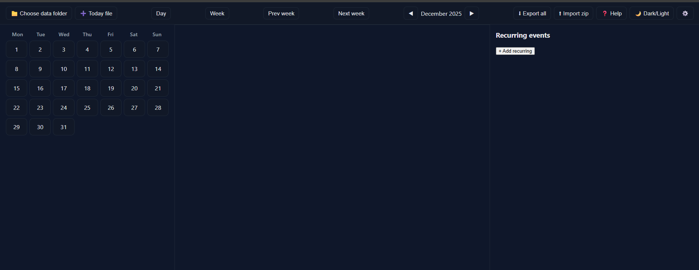
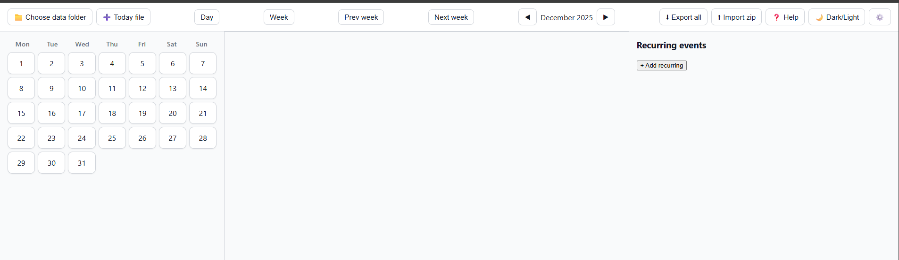

# 🗓️ Local Scheduler

A privacy‑first, offline calendar and task manager that stores your data directly on your local drive — no cloud, no login, no tracking.

## ✨ Features
- Daily activity planner with checklists and optional time slots
- Recurring events (daily, weekly, monthly) with flexible intervals
- Local file storage using the File System Access API
- Background customization via `background.jpg` or `background.png`
- Export/import your entire calendar as a zip file
- Dark/light theme toggle with persistent preference
- Help and Settings overlays for easy onboarding and configuration
- Reminder notifications for upcoming recurring events
- Week view to visualize your schedule across 7 days

## 🚀 Getting Started
1. Clone or download this repository.
2. Open `index.html` in your browser.
3. Click **Choose data folder** to select where your calendar files will live.
4. Start adding activities, recurring events, and customizing your setup.

## 📸 Screenshot
- Dark Mode

- Light Mode

## 🛡️ Privacy
All data is stored locally on your device. Nothing is uploaded or shared.

## 🧠 Tech Stack
- HTML, CSS, JavaScript
- File System Access API
- IndexedDB
- JSZip
- Notification API
